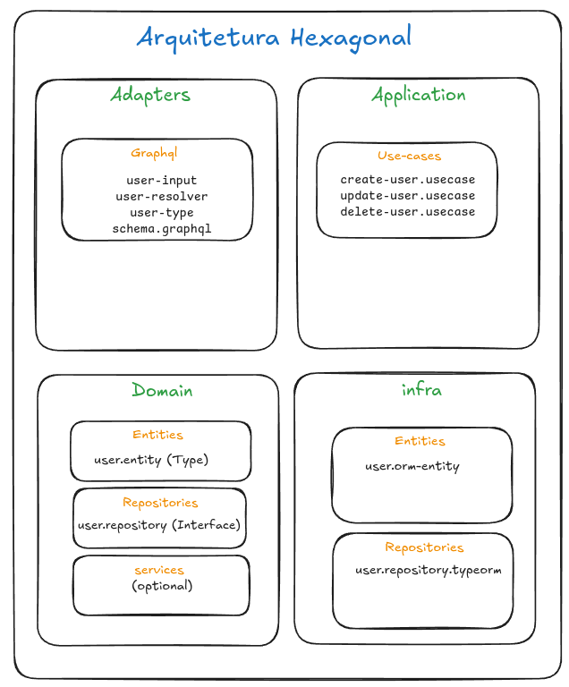
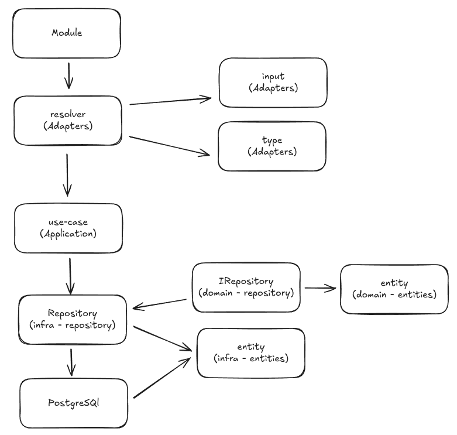

# 📘 Kredora 
### Sistema de Controle Financeiro com Arquitetura Hexagonal + GraphQL

Projeto desenvolvido para estudo de **Arquitetura Hexagonal**, **GraphQL**, **Next.js**, **PostgreSQL**, **Docker** e **TypeORM**.  
O objetivo é construir uma estrutura limpa, modular e escalável, aplicando boas práticas arquiteturais no backend e frontend.

---

## 📚 **Sobre o Projeto**

O **Kredora** é um sistema de controle financeiro que permite estudar:

- Arquitetura Hexagonal (Ports & Adapters)
- GraphQL (queries e mutations)
- Organização de pastas por domínio
- Execução de migrations no banco
- Uso de containers Docker
- Comunicação entre camadas desacopladas

---

## 🧱 **Arquitetura do Projeto**

Este projeto segue o padrão **Hexagonal Architecture**, onde o domínio é o centro da aplicação.

### 📐 **Visão da Arquitetura**



---

## 🔁 **Fluxo Geral do Sistema**



---

## 🛠️ **Tecnologias Utilizadas**

- **Next.js**
- **GraphQL**
- **TypeORM**
- **PostgreSQL**
- **Docker / Docker Compose**
- **Arquitetura Hexagonal**
- **Node.js**

---

## 📁 **Estrutura de Pastas (Hexagonal)**

```sh
/src
├── modules
│   ├── user
│   │   ├── domain
│   │   │   ├── entities
│   │   │   │   └── user.entity.ts
│   │   │   ├── repositories
│   │   │   │   └── user.repository.ts
│   │   │   └── services (opcional)
│   │   ├── application
│   │   │   ├── use-cases
│   │   │   │   ├── create-user.usecase.ts
│   │   │   │   ├── update-user.usecase.ts
│   │   │   │   ├── delete-user.usecase.ts
│   │   │   │   └── list-user.usecase.ts
│   │   ├── infrastructure
│   │   │   ├── entities
│   │   │   │   └── user.orm-entity.ts
│   │   │   ├── repositories
│   │   │   │   └── user.repository.typeorm.ts
│   │   ├── adapters
│   │   │   └── graphql
│   │   │       ├── user.resolver.ts
│   │   │       ├── user.type.ts
│   │   │       ├── user.input.ts
│   │   │       └── schema.graphql
│   │   └── user.module.ts
```

- **adapters** → Entrada/saída (GraphQL), validações.
- **application** → Valida permissões, orquestra transações.  
- **domain** → Regras de negócio puras.
- **infrastructure** → Banco, repositórios, implementações. 

---

## 🐘 **Banco de Dados & Migrations**

As migrations são realizadas usando **TypeORM**.

### ➕ Criar uma nova migration

```sh
npx typeorm migration:create migrations/CreateUser
```

## 🎯 **Objetivo do Projeto**

  - Este projeto serve como base para estudo de:
    - Arquitetura Hexagonal em Node.js
    - Operações GraphQL
    - Migrations em bancos SQL
    - Deploy containerizado
    - Boas práticas de modularização

## 👨‍💻 **Autor**

Lucas Oliveira
Projeto criado para estudo e aprimoramento de arquitetura backend + GraphQL.
